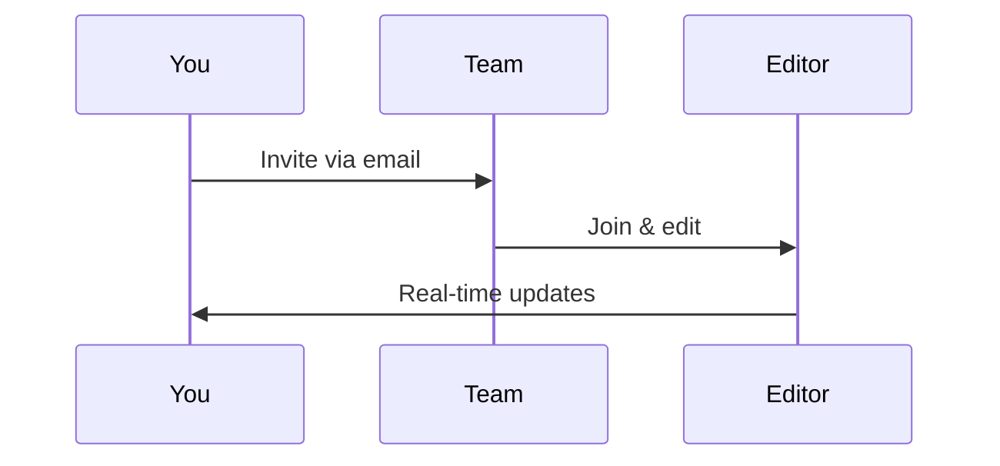

## Overview

Andrew Piven provides powerful tools to streamline your documentation workflow. You create, organize, collaborate, and track changes with ease. Key features include intuitive document editing, flexible project structures, real-time collaboration, and robust search with version history.

<Columns cols={3}>
  <Card title="Document Creation" icon="edit-3" href="#document-creation">
    Build rich MDX pages with live previews.
  </Card>
  <Card title="Project Organization" icon="folder" href="#project-organization">
    Structure docs hierarchically with folders and tags.
  </Card>
  <Card title="Collaboration" icon="users" href="#collaboration">
    Share, review, and co-edit in real time.
  </Card>
</Columns>

<Callout kind="tip">
  Start with the quickstart guide at <a href="/quickstart">/quickstart</a> to set up your first project.
</Callout>

## Document Creation and Editing

You create new documents directly in the editor. Andrew Piven supports MDX for interactive components like tabs and steps.

<Steps>
  <Step title="Create New Document" icon="plus">
    Navigate to your project dashboard and click `New Document`.
  </Step>
  <Step title="Edit with MDX" icon="edit">
    Use the split-view editor. Write Markdown and add components.
  </Step>
  <Step title="Preview and Publish" icon="eye">
    Preview changes live, then publish to make live.
  </Step>
</Steps>

Here's a basic MDX example you embed:

<CodeGroup tabs="MDX,Markdown">
  ```mdx
  ## Welcome

  <Callout kind="info">
    This is interactive documentation.
  </Callout>
  ```
  ```markdown
  ## Welcome

  > This is interactive documentation.
  ```
</CodeGroup>

## Project Organization Tools

Organize your documentation with folders, tags, and navigation menus. You structure content to match your project's needs.

<Tabs>
  <Tab title="Folders" icon="folder">
    Create nested folders for hierarchical navigation.

    ```bash
    mkdir docs/introduction
    mkdir docs/guides
    echo "# Intro" > docs/introduction/index.mdx
    ```
  </Tab>
  <Tab title="Tags" icon="tag">
    Assign tags for filtering and search.

    ```json
    {
      "tags": ["guide", "api", "quickstart"]
    }
    ```
  </Tab>
</Tabs>

## Collaboration and Sharing Options

Invite team members and share links securely. You enable real-time editing and comments.

<Columns cols={2}>
  <Card title="Invite Collaborators" icon="user-plus" href="#">
    Add users by email with role-based permissions.
  </Card>
  <Card title="Share Links" icon="share-2" href="#">
    Generate public or private links with expiration.
  </Card>
</Columns>



<Callout kind="alert">
  Always review changes before publishing to maintain quality.
</Callout>

## Search and Version Control

Andrew Piven offers full-text search across all documents. Track changes with built-in version history.

### Search

Use the global search bar to find content instantly. Supports fuzzy matching and filters by tags.

### Version Control

View diffs and revert changes easily.

<Expandable title="Advanced Version API Example" default-open="false">
  Integrate version control via API.

  <Request tabs="cURL,JavaScript">
    ```bash
    curl -X GET https://api.example.com/projects/{projectId}/docs/{docId}/versions \
      -H "Authorization: Bearer YOUR_TOKEN"
    ```
    ```javascript
    const response = await fetch(`https://api.example.com/projects/${projectId}/docs/${docId}/versions`, {
      headers: { Authorization: `Bearer ${YOUR_TOKEN}` }
    });
    const versions = await response.json();
    ```
  </Request>
</Expandable>

<ParamField path="projectId" param-type="string" required="true">
  Your project identifier.
</ParamField>

<ParamField header="Authorization" param-type="string" required="true">
  Bearer token for authentication.
</ParamField>

You now have a solid foundation for using Andrew Piven's core features. Explore advanced topics in the full documentation.